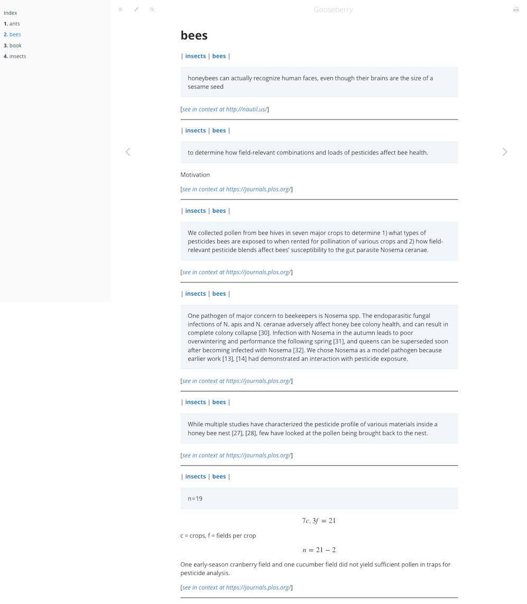
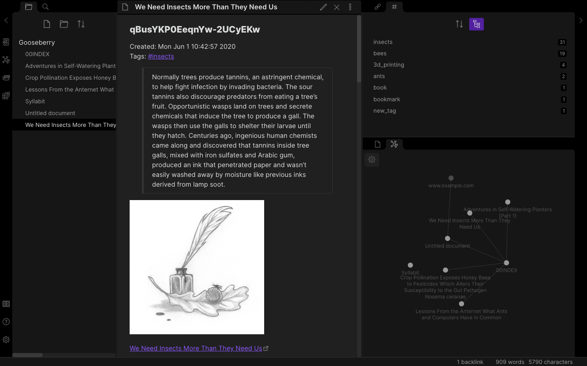

# Gooseberry - a Knowledge Base for the Lazy

[](https://crates.io/crates/gooseberry)
[](https://github.com/out-of-cheese-error/gooseberry/actions)
[](https://GitHub.com/out-of-cheese-error/gooseberry/releases/)
[](https://deps.rs/repo/github/out-of-cheese-error/gooseberry)

**WIP**

Gooseberry provides a command-line interface for [Hypothesis](https://web.hypothes.is/) (a tool to annotate the web) and lets you generate a
knowledge-base wiki without you having to actually type your knowledge out.

## Table of Contents

* [Install](#install)
    * [Installation requirements](#installation-requirements)
    * [Binaries](#binaries)
    * [With brew (OSX)](#with-brew-osx)
* [Contributing](#contributing)
* [Motivation](#motivation)
* [A typical workflow](#a-typical-workflow)
* [Some advantages](#some-advantages)
* [Customization](#customization)
* [Hypothesis](#hypothesis)
* [Knowledge base](#knowledge-base)
    * [Knowledge base directory](#knowledge-base-directory)
    * [Annotation template](#annotation-template)
    * [Page template](#page-template)
    * [Grouping annotations into folders and pages](#grouping-annotations-into-folders-and-pages)
    * [Sorting annotations within a page](#sorting-annotations-within-a-page)
    * [Index link template](#index-link-template)
    * [Index filename](#index-filename)
    * [File extensions](#file-extensions)
* [Why "Gooseberry"?](#why-gooseberry)

## Install

### Installation requirements

* A Hypothesis account, and a personal API token obtained as described [here](https://h.readthedocs.io/en/latest/api/authorization/).
* [bat](https://github.com/sharkdp/bat) to display highlighted markdown in the terminal.

### Binaries

See the [releases](https://github.com/out-of-cheese-error/gooseberry/releases/latest)

* OSX - allow `gooseberry` via System Preferences (necessary in Catalina at least)
* Linux - `chmod +x gooseberry`
* Currently, doesn't work on Windows (waiting on [this issue](https://github.com/lotabout/skim/issues/293))

### With brew (OSX)

```bash
brew tap out-of-cheese-error/gooseberry && brew install gooseberry
```

## Contributing

See [CONTRIBUTING.md](CONTRIBUTING.md) for an in-depth explanation of how Gooseberry works and what could be improved.

## Motivation

So yes, knowledge-base tools are old hat and a dime a dozen, and we really have no excuse to not have a nice big tangled folder of markdown files
filled with our overflowing wisdom. But after spending all day writing code and papers and tasks, it just isn't fair that our reading time also needs
to be typing time to get all that knowledge down. And if we don't type things out our fancy knowledge-base is bare, empty, and sad.

In comes Gooseberry - a tool to build a knowledge base from highlighting and annotating passages while reading news articles, blog posts, papers, what
have you. Gooseberry combines the ease of annotation offered by [Hypothesis](https://web.hypothes.is/), bulk tagging and organization support in the
command line, and a customizable plaintext wiki with HandleBars templating.

## A typical workflow

1. Find an article, blog post, paper etc. to read.
2. Highlight lines and facts you'd like to remember later. You can add comments and tags already if you're up for it but the focus can also be just on
   reading and highlighting without thinking too much about taking notes.
3. More often than not, when one gets into a topic it ends in 50 open tabs of subtopics. This is fine, keep reading and highlighting away, we'll get
   back to this.
4. Finally, once your thirst for knowledge has been fulfilled, fire up a terminal and run
    + `gooseberry sync` to download all your latest highlights and annotations.
    + `gooseberry tag --from "9a.m." topic` to tag everything you've read this morning with the topic you were looking into. This subcommand is super
      flexible. You can tag something by a website, so that all annotations from subtopic B's wikipedia page are tagged as B for instance. Or just
      open up `search` to search your annotations and add tags to everything matching a search query (or remove tags and annotations). Tags are very
      nestable, definitely make use of this - e.g. all annotations today may be about topic A, five of them are also subtopic B etc.
    + `gooseberry make` to add all this new tagged information to your knowledge base.

Here's an example. Today I read and annotated three articles about insects:
this [Nautilus article titled "We need insects more than they need us"](https://nautil.us/issue/73/play/we-need-insects-more-than-they-need-us),
this [publication about honey bees and pesticides](https://journals.plos.org/plosone/article?id=10.1371/journal.pone.0070182),
and [an Atlantic article about the "anternet"](https://www.theatlantic.com/technology/archive/2012/08/lessons-from-the-anternet-what-ants-and-computers-have-in-common/261580/)
.

I synced and tagged these annotations:


Then ran `gooseberry make` to make an `mdBook` style wiki which I could then open in the browser:



Or an Obsidian style wiki, with annotations grouped into folders based on their base URI



Annotation text is just markdown so text formatting, LaTeX, pictures etc. goes too!


The annotation template is configurable, as is the folder and grouping structure. Each annotation can link back to the position in the website that
you got it from, if ever you feel like you're missing context.

## Some advantages

* You barely have to type while reading unless you're in the mood for taking notes.
* If you're in the mood, the note-taking won't involve window switching.
* Even without using the wiki functionality you end up with a CLI to quickly tag your Hypothesis annotations.
* Even without using the tagging functionality you end up with a pretty cool wiki listing all your annotations.
* Since it's just plaintext, and the template can be customized, you can integrate it with any knowledge base system accepting plaintext files
  (like Obsidian, mdBook, org-mode, vim-wiki, etc.)

## Customization

The default config TOML file is located in

* Linux: `/home/<username>/.config`
* Mac: `/Users/<username>/Library/Preferences`

Change this by creating a config file with `gooseberry config default > config.toml`, modifying the contents, and then setting the environment
variable `$GOOSEBERRY_CONFIG` to point to this file.

### Hypothesis

Authorize Hypothesis either by setting the `$HYPOTHESIS_NAME` and `$HYPOTHESIS_KEY` environment variables to your username and developer API token or
by running `gooseberry config authorize`.

Gooseberry takes annotations from a given Hypothesis group which you can create/set with `gooseberry config group`.

### Knowledge base

You can set all the below options at once by running `gooseberry config kb all` or changing the corresponding keys in the config file (found
at `gooseberry config location`)

#### Knowledge base directory

`gooseberry config kb directory`

The directory to save the generated knowledge base files.

**IMPORTANT:** This directory is cleared at every sync so if you're storing Hypothesis annotations alongside other notes, make sure to make a separate
folder.

#### Annotation template

`gooseberry config kb annotation`

Change the template used for rendering the annotation.

The following keys can be used inside the template

* `{{ id }}` - Annotation ID
* `created` - Date of creation. Use with the `date_format` helper
* `updated` - Date of creation. Use with the `date_format` helper
* `{{ user }}` - User account ID formatted as `acct:<username>@<authority>`
* `{{ uri }}` - Annotation URI
* `{{ base_uri }}` - Base website of URI, i.e just the protocol and domain.
    * e.g. https://github.com/rust-lang/cargo?asdf becomes https://github.com/
* `{{ incontext }}` - Link to annotation in context (opens the Hypothesis sidebar and focuses on the annotation)
* `highlight` - List of selected/highlighted lines from document (split by newline)
* `{{ text }}` - The text content of the annotation body
* `tags` - A list of tags associated with the annotation.
* `{{ group }}` - ID of Hypothesis group,
* `references` - List of annotation IDs for any annotations this annotation references (e.g. is a reply to)
* `{{ display_name }}` - Display name of annotation creator. This may not be set.

See the [Handlebars Language Guide](https://handlebarsjs.com/guide/#what-is-handlebars) for more on templating. Some examples for using the list keys
and for formatting dates are shown below for different systems:

* mdBook

```markdown
##### {{date_format "%c" (created)}} - *{{id}}*

{{#each tags}}| [{{this}}]({{this}}.md) {{#if @last}}|{{/if}}{{/each}}

{{#each highlight}}> {{this}}{{/each}}

{{text}}

[See in context]({{incontext}})
```

Renders as:

```markdown
##### Sat Jan 16 11:12:49 2021 - *test*

| [tag1](tag1.md) | [tag2](tag2.md) |

> exact text highlighted in website

testing annotation

[See in context](https://incontext_link.com)
```

This makes each tag a link to a dedicated page consisting of annotations with that tag - you can set this up by configuring the
hierarchy (`hierarchy = ["tag"]`).

* Obsidian

```markdown
### {{id}}

Created: {{date_format "%c" (created)}} Tags: {{#each tags}}#{{this}}{{#unless @last}}, {{/unless}}{{/each}}

{{#each highlight}}> {{this}}{{/each}}

{{text}}

[See in context]({{incontext}})
```

Renders as:

```markdown
### test

Created: Sat Jan 16 10:22:20 2021 Tags: #tag1, #tag2

> exact text highlighted in website

testing annotation
```

This uses #tags b/c Obsidian likes those.

TODO add org-mode example

#### Page template

`gooseberry config kb page`

Change the template used for rendering a single page (NOT the Index page).

The following keys can be used inside the template:

* `{{ name }}` - file stem
* `{{ relative_path }}` - path relative to KB directory
* `{{ absolute_path }}` - full path on filesystem
* `annotations` - a list of *rendered* annotations (according to the annotation template)

The default template is:

```markdown
# {{name}}

{{#each annotations}}{{this}}{{/each}}

```

#### Grouping annotations into folders and pages

`gooseberry config kb hierarchy`

The hierarchy defines how the folder and file structure of the knowledge base looks and which annotations are on what pages.

The available options are:

* Empty - Set `hierarchy = []` to have all annotations rendered on the index page.
* Tag - Groups annotations by tag
* URI - Groups annotations by their URI
* BaseURI - Groups annotations by their base URI
* ID - Groups annotations by annotation ID.

Multiple hierarchies combined make folders and sub-folders, with the last entry defining pages.

e.g.

`hierarchy = ["BaseURI", "Tag"]` would make a separate folder for each base_uri. Within each folder would be a page for each tag consisting of
annotations marked with that tag.

`hierarchy = ["Tag"]` gives the structure in the `mdbook` figure above, i.e. no folders, a page for each tag.

#### Sorting annotations within a page

`gooseberry config kb sort`

This defines how annotations are sorted within each page.

The available options are:

* Tag - Sorts by tag (multiple tags are considered as "tag1,tag2,tag3" for sorting)
* URI
* BaseURI
* ID
* Created
* Updated

Multiple sort options can be combined in order of priority e.g. `sort = ["Tag", "Created"]` sorts by tags, then by the date of creation.

#### Index link template

`gooseberry config kb link`

This configures the index file, which generally contains links to all other pages in the generated knowledge base
(unless `hierarchy=[]` in which case all annotations are rendered on the index page). The template controls how each of these links are rendered.

Available keys:

* `{{ name }}` - file stem
* `{{ relative_path }}` - path relative to KB directory
* `{{ absolute_path }}` - full path on filesystem

Examples:

* mdBook

```markdown
- [{{name}}]({{relative_path}})

```

* Obsidian

```markdown
- [[{{name}}]]

```

to make internal links, or

```markdown
- ![[{{name}}]]

```

to transclude files

* Org-mode

```org
- [[{{relative_path}}][{{name}}]]

```

#### Index filename

`gooseberry config kb index`

The name of the Index file, e.g. `mdbook` needs this to be called "SUMMARY" and in Obisidan you could use "00INDEX" to make it show up first in the
file explorer.

#### File extensions

`gooseberry config kb extension`

e.g. "md", "org", "txt" etc. (**Don't include the .**)

## Why "Gooseberry"?

Because Discworld will never let me down when it comes to names:
[Dis-organizer Mark 5, the Gooseberry](https://wiki.lspace.org/mediawiki/Dis-organiser)
